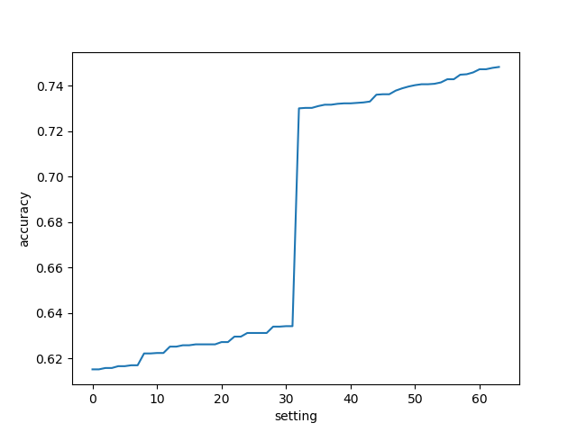

# Social Community Analysis of Ethereum Main Accounts.

This project analyses twitter users related to Ethereum's Blockchain. It makes a deep analysis of those Twitter accounts, thei rfollowers and their users. Then it analyses also tweets made by those accounts for making a gender calssification system according to the vectorized words from the accounts.

The project consists of four parts:

1. **Collect**: The project collects raw data from specific Twitter accounts social network. It also collects data for census names. Additionally, we collect real time tweets related to pecified blockchain related words.
        - For changing the Twitter accounts you want to collect, modify the ethereum-accounts.txt under `data` folder.
2. Perform **community detection** to cluster users into communities.
3. Perform **supervised classification** to annotate messages and/or users according to some criterion.
4. Analyze the results and **summarize** your conclusions. 

## Summary

The project picks main Ethereum's Blockchain realated twitter accounts, obtains their friends and followers, and for the top 10 most frequent twitter accounts also picks all their frineds and followers.

### Classifying

For the classifying part, we have picked 5.000 real time tweets that contain 
Blockchain related words, and our aim is to classify those users that made those tweets as female or male and see whether there is a strong difference in gender related to the active people on twitter talking about Blockchain stuff or not. For testing the model, we picked in the same way 500 real time tweets realted to the same words, and manually labeled their gender.

Finally, regarding the classification by gender, we can see that we have a __best accuracy of 0.74__, and if we see the plot of accuracies, we can see a big difference between the settings that use the description for tokenization of the tokens, and the ones that do not use it. So it is really important to use the description for the vectorizatioin of the tweets, actually you can see a summary of mean accuracies per setting, being the use description setting the best one. We can also see in the summary of top missclassified, that many of them are due to the user's writting in their description something about their families for example. You can see in one example that one female has in the description "very proud of my  husband", and husband is a strong coefficient for males and that causes the missclassification. So we conclude that mainly the errors are because of description about other people distinct to the user using terms that are strong coefficients for the other users'.

You can see in the following image the accuracy evolution with the different combinations of characteristics:




### Clustering

Regarding the clustering, we can see that the different methods tested cluster the community in 3 different clusters. When analyzing the members for each cluster, we focused in trying to analyze how the different main initial 
accounts where clustered. We saw that as more or less expected, ConsesnsyAcademy, gavoyfork and trufflesuite are nearly always clustered together, as they are accounts focused on development of Smart Contracts in Ethereum mainly and gavoforky is one of the founders of Ethereum, but is more active regarding development than is Vitalik.
On the other hand, binance and coinbase, the two crypto exchanges are always clustered together and oftenly clustered with Vitalik Buterin and ethereum official account. The only account that is in one case cluster alone, is trufflesuite, and this can be due to the distinct services they have not strictly realted to Ethereum Blockchain.

You can see the network graph in the following image:


You can see the clustering of the network following image:


### Summarizing

If you ran summary.py, it will call all the other 3 python scripts and you will see a summary of the results of all of them.

I have enabled an argument to be passed to summary.py, as the Girvan Newman algorithm takes more than 4 hours to run, if you do not pass the first argument as True to summarize.py, i.e. run it as:
python summarize.py True
it will only run the other two clustering algorithms which are much faster.

## SETUP

First of all install all the required packages by running:
`pip install -r requirements.txt`

Then, create a file named `twitter.cfg` in the root directory containing your `user_key` and `access_tokens`.

## EXECUTION

To run the project you should execute the following scripts in the specified order.
```
python collect.py
python cluster.py
python classify.py
python summarize.py
```
